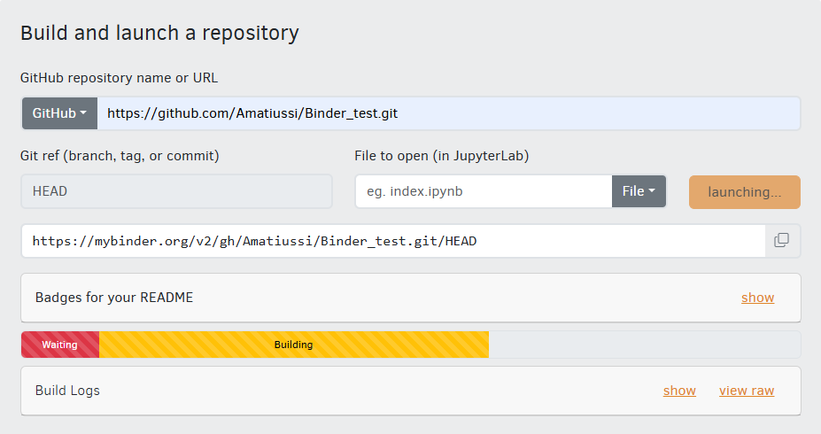

[](https://mybinder.org/v2/gh/Amatiussi/Binder_test.git/HEAD)
# Compartilhe Código R com Binder: Execute e Colabore sem Instalações
## Crie ambientes interativos para compartilhar e executar código R diretamente no navegador.

Este tutorial explica como configurar um repositório no GitHub para rodar código R diretamente no navegador usando o Binder. Com essa abordagem, você pode compartilhar seu código com outras pessoas sem que elas precisem instalar o R ou qualquer dependência localmente. É uma ferramenta para compartilhar scripts e projetos de forma acessível e reproduzível.

## 1. O que é o Binder?
O Binder é uma ferramenta que permite transformar repositórios GitHub em ambientes interativos acessíveis via navegador. Ele cria um ambiente virtual onde o código pode ser executado diretamente no navegador, sem a necessidade de instalação local. O Binder é especialmente útil para compartilhar projetos, análises estatísticas e scripts R, pois permite que outras pessoas interajam com o código e vejam os resultados em tempo real. Ele utiliza Jupyter Notebooks e suporta diversas linguagens de programação, incluindo R, Python e Julia. 

Por que usar o Binder?

- `Sem necessidade de instalações locais`: O código pode ser executado diretamente no navegador, sem a necessidade de instalar o R ou pacotes.
- `Reprodutibilidade`: O ambiente é configurado com todas as dependências necessárias, garantindo que o código funcione corretamente para qualquer usuário.
- `Facilidade de compartilhamento`: Basta gerar um link e qualquer pessoa poderá acessar e rodar o código R.

### 1.1 Como funciona o Binder?
O Binder funciona com base em três componentes principais:

- `Repositório GitHub`: O Binder usa o conteúdo do seu repositório GitHub para criar o ambiente interativo. Ele lê os arquivos de configuração (como runtime.txt, install.R e Dockerfile) para instalar as dependências necessárias.
- `Docker`: O Binder usa contêineres Docker para criar ambientes isolados e reproduzíveis. Isso garante que o ambiente criado seja consistente, independentemente do sistema operacional do usuário.
- `Jupyter Notebook`: O Binder usa o Jupyter Notebook como interface para executar o código. No caso de scripts R, ele usa o RStudio ou o Jupyter Notebook com o kernel R.

### 1.2 Nesse caso, o repositório precisa ser público?

> [!WARNING]  
> SIM! O repositório do GitHub deve ser público, pois o Binder precisa acessar seus arquivos para criar o ambiente.

O Binder não pode acessar repositórios privados, pois isso exigiria um token secreto. A equipe do Binder optou por não assumir a responsabilidade de lidar com tokens secretos, pois é um serviço público e uma prova de conceito tecnológico. Para saber mais sobre, confira: [Zero-to-Binder](https://the-turing-way.netlify.app/communication/binder/zero-to-binder.html).

No contexto deste tutorial, usaremos o Binder para configurar um ambiente online que permita executar scripts R diretamente do GitHub.

## 2. Passo a Passo para Configurar o Repositório

### 2.1 Preparar o Repositório e Adicionar Arquivos R

#### 2.1.1  Criar um Novo Repositório
- No GitHub, clique no botão `"New"` no canto superior direito;
- Dê um nome ao repositório (por exemplo, Binder_test);
- Escolha o repositório público;
- Marque a opção `"Add a README file"` (opcional);
- Clique em `"Create repository"`.

> [!TIP]
> Apesar do **README** ser opcional, ele é importante para documentar e explicar o seu repositório. Ele funciona como a `"porta de entrada"` do projeto, ajudando outras pessoas (e até você no futuro) a entender rapidamente do que se trata o código ou como utilizá-lo.

#### 2.1.2 Adicionar Arquivos Script.R no Repositório
- No repositório criado, clique no botão `"Add file"` no canto superior direito;
- Escolha `"Upload files"`;
- Arraste os arquivos `.R` para a área indicada ou clique em `"choose your files"` para selecioná-los;
- Clique em `"Commit changes"` para salvar as alterações;

> [!NOTE]  
> Além de fazer o upload de arquivos prontos, você também pode criar arquivos diretamente no GitHub sem precisar fazer o upload. Isso é útil se você quiser criar um arquivo **.R** do zero ou editar algo diretamente na interface do GitHub.
> Basta escolher `"Create new file"` e adicionar a extensão do arquivo **.R**.

### 2.2 Adicionar um Arquivo runtime.txt
O arquivo `runtime.txt` especifica a versão de uma linguagem de programação ou ambiente que deve ser usada para executar o código no ambiente criado.Ele é especialmente útil em plataformas como o Binder, onde você deseja garantir que o ambiente de execução seja configurado corretamente para reproduzir os resultados do seu código. Se você estiver usando R, o arquivo `runtime.txt` pode especificar a versão do R que deve ser instalada. 

- No seu repositório, clique no botão `"Add file"` e escolha `"Create new file"`.
- No campo de nome do arquivo, digite `runtime.txt`.
- No editor de texto que aparecer, especifique a versão do R que você deseja usar. Por exemplo:

```txt
r-4.4.2
```
- Clique em `"Commit changes"` para salvar o arquivo.

### 2.3 Adicionar um Arquivo install.R
O arquivo `install.R` é usado para instalar os pacotes R necessários para executar seu código. Isso garante que todas as dependências estejam disponíveis no ambiente do Binder.

- No seu repositório, clique no botão `"Add file"` e escolha `"Create new file"`.
- No campo de nome do arquivo, digite `install.R`.
- No editor de texto que aparecer, adicione os comandos para instalar os pacotes R necessários. Por exemplo:

```r
install.packages("ggplot2")
install.packages("dplyr")
```
- Clique em `"Commit changes"` para salvar o arquivo.

### 2.4 Adicionar um Arquivo Dockerfile
O `Dockerfile` serve para definir e personalizar o ambiente em que o seu código será executado, garantindo que todas as dependências e configurações necessárias estejam disponíveis de forma consistente e reproduzível.

- No seu repositório, clique no botão `"Add file"` e escolha `"Create new file"`.
- No campo de nome do arquivo, digite `Dockerfile`.
- No editor de texto que aparecer, adicione o seguinte conteúdo:
  
```dockerfile
FROM rocker/binder:4.0.0

# Copia o repositório para o diretório home do usuário
USER root
COPY . ${HOME}
RUN chown -R ${NB_USER} ${HOME}
USER ${NB_USER}

# Executa o script install.R, se existir
RUN if [ -f install.R ]; then R --quiet -f install.R; fi
```
- Clique em `"Commit changes"` para salvar o arquivo.

> [!IMPORTANT]  
> Detalhes: O Dockerfile é usado para personalizar o ambiente Docker. Ele copia o repositório para o ambiente e executa o script `install.R` para instalar as dependências.

### 2.5 Estrutura Final do Repositório
Após seguir os passos acima, a estrutura do seu repositório deve ser semelhante a esta:

```
Binder_test/
├── script.R
├── runtime.txt
├── install.R
├── Dockerfile
└── README.md
```

### 2.6 Criar o Link do Binder

- Acesse o Binder:
   - Vá para [Binder](https://mybinder.org/).
 
<p align="center">
  
</p>

- Insira a URL do Repositório:
   - No campo `"GitHub repository name or URL"`, insira a URL do seu repositório (por exemplo, https://github.com/Amatussi/Binder_test.git).

- Clique em "Launch":
   - O Binder criará um ambiente interativo com base no seu repositório. Isso pode levar alguns minutos, dependendo do tamanho do repositório e das dependências.

- Compartilhe o Link:
   - Após o Binder criar o ambiente, você terá um link que pode ser compartilhado com outras pessoas. Elas poderão executar o código R diretamente no navegador.

> [!IMPORTANT]  
> `Tempo de Build`: A primeira vez que você criar o ambiente no Binder pode levar alguns minutos, pois ele precisa instalar todas as dependências. Após a primeira execução, o ambiente será armazenado em cache, tornando as execuções subsequentes mais rápidas.

## Fim! 
Agora você sabe como configurar um repositório GitHub para compartilhar código R usando o Binder. Com essa abordagem, você pode criar ambientes interativos que permitem que outras pessoas executem seu código R diretamente no navegador, sem a necessidade de instalações locais. Isso facilita a colaboração em projetos e torna suas análises mais acessíveis e reproduzíveis.

[!NOTE]
Se precisar de mais personalizações ou encontrar algum erro, a documentação oficial do [Binder](https://mybinder.readthedocs.io/en/latest/) oferece recursos detalhados para explorar novas possibilidades.

🚀 Agora é só colocar em prática e compartilhar seu código R com o mundo! 🚀
